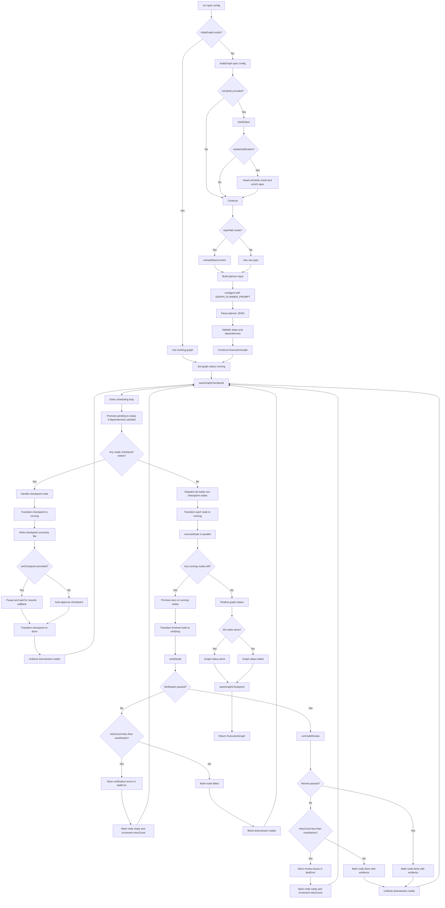
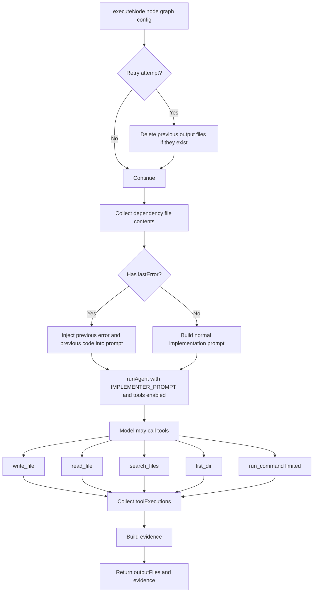
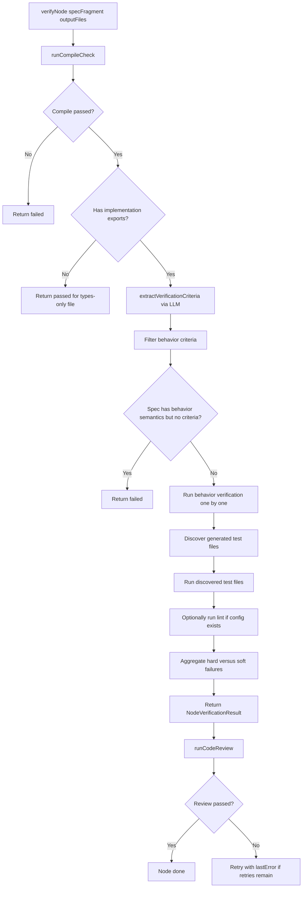
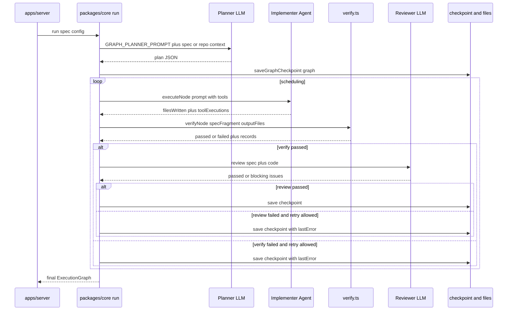

# Core AI Workflow

`packages/core` 的底层 AI workflow Mermaid 图整理。

## 1) packages/core 总流程图

```mermaid
flowchart TD
    A[run spec config] --> B{initialGraph exists?}
    B -- Yes --> C[Use existing graph]
    B -- No --> D[buildGraph spec config]

    D --> D1{onClarify provided?}
    D1 -- Yes --> D2[clarifySpec]
    D1 -- No --> D5[Skip clarify hook]

    D2 --> D3{needsClarification?}
    D3 -- Yes --> D4[Await onClarify result and enrich spec]
    D3 -- No --> D5[Continue]
    D4 --> D5

    D5 --> D6{repoPath exists?}
    D6 -- Yes --> D7[extractRepoContext]
    D6 -- No --> D8[Use raw spec]
    D7 --> D9[Build planner input]
    D8 --> D9

    D9 --> D10[runAgent with GRAPH_PLANNER_PROMPT]
    D10 --> D11[Parse planner JSON]
    D11 --> D12[Validate steps and dependencies]
    D12 --> D13[Construct ExecutionGraph]

    C --> E[Set graph status running]
    D13 --> E

    E --> F[saveGraphCheckpoint]
    F --> G[Enter scheduling loop]

    G --> H[Promote pending to ready if dependencies satisfied]
    H --> I{Any ready checkpoint nodes?}

    I -- Yes --> J[Handle checkpoint node]
    J --> J1[Transition checkpoint to running]
    J1 --> J2[Write checkpoint summary file]
    J2 --> J3{onCheckpoint provided?}
    J3 -- Yes --> J4[Pause and wait for resume callback]
    J3 -- No --> J5[Auto-approve checkpoint]
    J4 --> J6[Transition checkpoint to done]
    J5 --> J6
    J6 --> J7[Unblock downstream nodes]
    J7 --> F

    I -- No --> K[Dispatch all ready non-checkpoint nodes]
    K --> L[Transition each node to running]
    L --> M[executeNode in parallel]
    M --> N{Any running nodes left?}

    N -- No --> O[Finalize graph status]
    N -- Yes --> P[Promise.race on running nodes]

    P --> Q[Transition finished node to verifying]
    Q --> R[verifyNode]

    R --> S{Verification passed?}
    S -- No --> T{retryCount less than maxRetries?}
    T -- Yes --> U[Store verification errors in lastError]
    U --> V[Mark node ready and increment retryCount]
    V --> F
    T -- No --> W[Mark node failed]
    W --> X[Block downstream nodes]
    X --> F

    S -- Yes --> Y[runCodeReview]
    Y --> Z{Review passed?}
    Z -- No --> Z1{retryCount less than maxRetries?}
    Z1 -- Yes --> Z2[Store review issues in lastError]
    Z2 --> Z3[Mark node ready and increment retryCount]
    Z3 --> F
    Z1 -- No --> Z4[Mark node done with evidence]
    Z4 --> AB

    Z -- Yes --> AA[Mark node done with evidence]
    AA --> AB[Unblock downstream nodes]
    AB --> F

    O --> O1{All nodes done?}
    O1 -- Yes --> O2[Graph status done]
    O1 -- No --> O3[Graph status failed]
    O2 --> O4[saveGraphCheckpoint]
    O3 --> O4
    O4 --> O5[Return ExecutionGraph]
```

## 2) 单节点执行子流程图

```mermaid
flowchart TD
    A[executeNode node graph config] --> B{Retry attempt?}
    B -- Yes --> C[Delete previous output files if they exist]
    B -- No --> D[Continue]

    C --> D
    D --> E[Collect dependency file contents]
    E --> F{Has lastError?}
    F -- Yes --> G[Inject previous error and previous code into prompt]
    F -- No --> H[Build normal implementation prompt]

    G --> I[runAgent with IMPLEMENTER_PROMPT and tools enabled]
    H --> I

    I --> J[Model may call tools]
    J --> J1[write_file]
    J --> J2[read_file]
    J --> J3[search_files]
    J --> J4[list_dir]
    J --> J5[run_command limited]

    J1 --> K[Collect toolExecutions]
    J2 --> K
    J3 --> K
    J4 --> K
    J5 --> K

    K --> L[Build evidence]
    L --> M[Return outputFiles and evidence]
```

## 3) 验证与审查子流程图

```mermaid
flowchart TD
    A[verifyNode specFragment outputFiles] --> B[runCompileCheck]
    B --> C{Compile passed?}
    C -- No --> D[Return failed]
    C -- Yes --> E{Has implementation exports?}

    E -- No --> F[Return passed for types-only file]
    E -- Yes --> G[extractVerificationCriteria via LLM]

    G --> H[Filter behavior criteria]
    H --> I{Spec has behavior semantics but no criteria?}
    I -- Yes --> J[Return failed]
    I -- No --> K[Run behavior verification one by one]

    K --> L[Discover generated test files]
    L --> M[Run discovered test files]
    M --> N[Optionally run lint if config exists]
    N --> O[Aggregate hard versus soft failures]
    O --> P[Return NodeVerificationResult]

    P --> Q[runCodeReview]
    Q --> R{Review passed?}
    R -- Yes --> S[Node done]
    R -- No --> T[Retry with lastError if retries remain]
```

## 4) 时序理解图

```mermaid
sequenceDiagram
    participant Server as apps/server
    participant Core as packages/core run
    participant Planner as Planner LLM
    participant Impl as Implementer Agent
    participant Verify as verify.ts
    participant Review as Reviewer LLM
    participant Disk as checkpoint and files

    Server->>Core: run spec config
    Core->>Planner: GRAPH_PLANNER_PROMPT plus spec or repo context
    Planner-->>Core: plan JSON
    Core->>Disk: saveGraphCheckpoint graph

    loop scheduling
        Core->>Impl: executeNode prompt with tools
        Impl-->>Core: filesWritten plus toolExecutions
        Core->>Verify: verifyNode specFragment outputFiles
        Verify-->>Core: passed or failed plus records

        alt verify passed
            Core->>Review: review spec plus code
            Review-->>Core: passed or blocking issues
            alt review passed
                Core->>Disk: save checkpoint
            else review failed and retry allowed
                Core->>Disk: save checkpoint with lastError
            end
        else verify failed and retry allowed
            Core->>Disk: save checkpoint with lastError
        end
    end

    Core-->>Server: final ExecutionGraph
```
