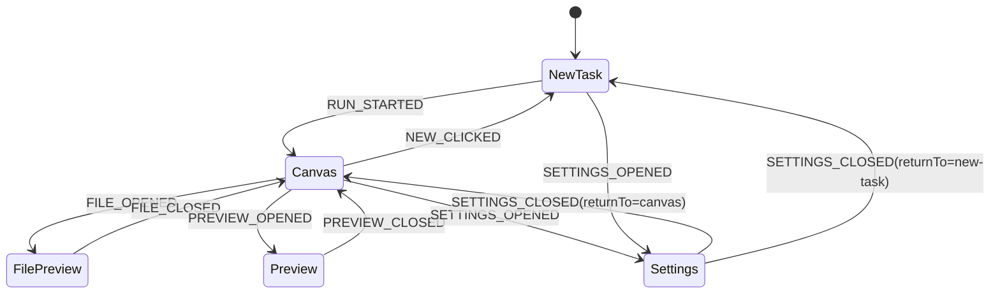
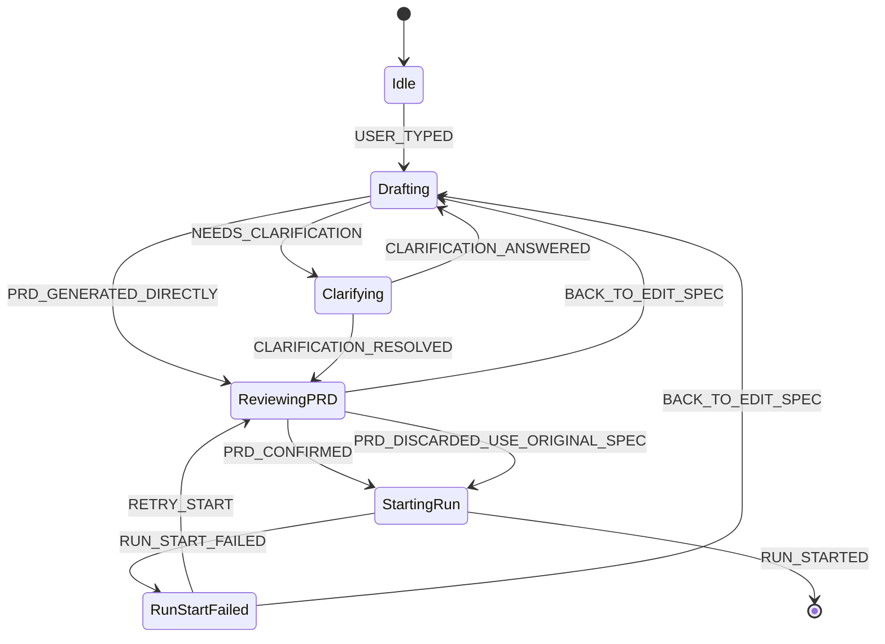
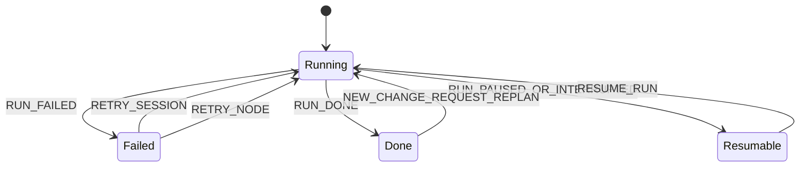

# New Task → PRD → Canvas State Machine

## Status
Draft v0.1 — prepared for product / frontend review on 2026-05-09

---

## Why this document exists

The current Shipyard frontend already supports most of the **behavioral chain** needed for task creation:

- user enters a request
- the system can generate a PRD draft
- the user can confirm or discard the PRD
- execution can start and open a session
- the canvas then shows the execution graph

However, the UI does **not yet express this flow as a first-class product state**.

Today, the central area defaults to the canvas, while the task-definition experience lives implicitly inside the right-side chat panel. This makes the workflow feel inverted:

- before execution starts, users are actually still **defining the task**
- but the product already visually places them in the **execution workspace**

This document proposes a clearer interaction model:

> **Before execution begins, the center of the app should behave like an agent-style task definition workspace.**
> **Only after PRD/spec confirmation and run start should the app enter the canvas execution workspace.**

---

## Product intent

### Desired user experience

When the user:

- first opens the app, or
- clicks the left sidebar `+ New`

…the center area should **not** show an empty canvas.

Instead, it should show a **task creation experience** similar to GPT / AI agent products:

- a centered input/composer
- clarifications if needed
- PRD review/editing
- explicit confirmation before execution

After the user confirms the PRD or final spec and execution starts, the UI transitions into the normal Shipyard workspace:

- center = canvas
- right = chat / logs / node actions
- left = project/session navigation

---

## Core product model

We should treat the frontend as a **two-stage workspace**:

1. **Task Definition Stage**
   - user is still describing, refining, and confirming the work
   - center area behaves like an agent/composer interface

2. **Execution Stage**
   - the work has been accepted and started
   - center area becomes the canvas graph workspace

This is a better mental model than “canvas is always the center, chat is always the right rail”.

---

# 1. Current implementation signals

The current codebase already contains most of the logic needed for this transition.

## Relevant current files

- `apps/web/src/App.tsx`
- `apps/web/src/features/session/useSession.ts`
- `apps/web/src/features/workspace/useWorkspaceShell.ts`
- `apps/web/src/features/chat/containers/ChatPanelContainer.tsx`
- `apps/web/src/domains/execution/runController.ts`
- `apps/web/src/domains/workspace/store.ts`

## Existing behavioral chain already present

### New session behavior
`handleNewSession()` currently clears the active session and resets session-scoped view state.

### Chat supports pre-run orchestration
`ChatPanelContainer` + `runController` already support:

- user input
- `new_run` detection
- PRD generation
- PRD confirm / discard
- calling `runSpec`
- activating the started session

### Run activation already transitions into session context
`activateStartedSession()` already:

- sets the live session
- marks status as running
- loads the session graph into the execution store

### Conclusion
The missing piece is not backend capability.
The missing piece is **explicit UI state modeling**.

---

# 2. Proposed state architecture

To avoid a single giant enum or a pile of booleans, the state should be modeled in **layers**.

## 2.1 Layer A — Workspace Surface

This layer answers:

> What is the center area currently showing?

```ts
type WorkspaceSurface =
  | { type: "new-task" }
  | { type: "canvas"; session: SessionRef }
  | { type: "file"; file: SelectedFileIdentity; session: SessionRef }
  | { type: "preview"; session: SessionRef }
  | { type: "settings"; returnTo: "new-task" | "canvas" };
```

This replaces scattered display decisions like:

- `selectedFile`
- `isPreviewOpen`
- `isSettingsOpen`
- implicit fallback to `<Canvas />`

## 2.2 Layer B — New Task Creation Flow

This layer only exists when `surface.type === "new-task"`.

It answers:

> Where is the user inside the task-definition journey?

```ts
type CreationFlow =
  | {
      stage: "idle";
      draftSpec: string;
      messages: DraftMessage[];
    }
  | {
      stage: "clarifying";
      draftSpec: string;
      messages: DraftMessage[];
      clarification: ClarificationPayload;
    }
  | {
      stage: "reviewing_prd";
      draftSpec: string;
      messages: DraftMessage[];
      prd: string;
      source: "generated" | "edited";
    }
  | {
      stage: "starting_run";
      draftSpec: string;
      messages: DraftMessage[];
      prd: string;
    }
  | {
      stage: "run_start_failed";
      draftSpec: string;
      messages: DraftMessage[];
      prd: string;
      error: string;
    };
```

## 2.3 Layer C — Execution Flow

This layer already largely exists in the execution store.

It answers:

> What is the current execution status of the active session?

```ts
type ExecutionFlow = "idle" | "running" | "failed" | "done" | "resumable";
```

---

# 3. Primary UI state machine

This is the high-level surface transition model.



### Interpretation

- app startup defaults to `NewTask`
- selecting or starting a session moves the center to `Canvas`
- file / preview / settings remain alternate surfaces
- clicking `+ New` returns the product to task-definition mode

---

# 4. New task creation state machine

This is the core UX flow being proposed.



## State meanings

### `idle`
No meaningful task yet. Show centered landing experience.

### `drafting`
The user is actively describing the task.

### `clarifying`
The system needs a few answers before it can responsibly generate the PRD or plan.

### `reviewing_prd`
The system has produced a PRD draft; user can edit, confirm, or return.

### `starting_run`
User has confirmed intent; the system is creating the real execution session.

### `run_start_failed`
Run creation failed. User can retry or go back.

---

# 5. Execution state machine

Once the user is in the canvas stage, the execution status remains a separate concern.



This is conceptually separate from the creation flow.

---

# 6. UI shape proposal

## 6.1 New Task Stage

### Left rail
Keep the current project/session navigation.

### Center
Replace empty canvas with a dedicated **Task Creation Screen**.

Suggested content:

- welcome heading / positioning copy
- centered task input area
- recent draft messages
- clarification cards if needed
- PRD editor card
- explicit CTA to start execution

### Right rail
For MVP, hide the right rail while in `new-task`.

Reason:

- there is only one primary user job before execution: define the task
- splitting that across center + right rail creates visual competition
- agent-like input should be visually central in this stage

## 6.2 Execution Stage

### Left rail
Keep project/session navigation.

### Center
Canvas graph.

### Right rail
Keep chat / logs / retry / node detail tools.

---

# 7. Why this should be modeled explicitly

## Problem with current implicit approach

Right now, the flow is represented indirectly through multiple pieces of state:

- `activeSession`
- `selectedFile`
- `isPreviewOpen`
- `isSettingsOpen`
- `pendingPRD`
- `loading`
- `runStatus`

This is already an implicit state machine, but it is split across:

- local React state
- workspace store
- execution store
- container-specific effects

That makes the main product flow hard to reason about and harder to extend.

## Benefit of explicit state

An explicit state machine gives us:

- clear ownership of UI phase
- predictable transitions
- easier review of UX rules
- easier test coverage
- cleaner component composition
- less boolean-prop / boolean-branch growth

This aligns with the composition principle of preferring **explicit variants** over accumulating mode flags.

---

# 8. Recommended component architecture

## 8.1 Stable shell

The app shell should remain structurally stable:

```tsx
<AppShell>
  <Sidebar />
  <CenterSurface />
  <RightPanel />
</AppShell>
```

## 8.2 Center surface router

Central rendering should be handled by a dedicated surface component rather than embedded `if/else` fallback logic inside `App.tsx`.

```tsx
function CenterSurface() {
  switch (surface.type) {
    case "new-task":
      return <TaskCreationScreen />;
    case "canvas":
      return <Canvas />;
    case "file":
      return <FilePreview />;
    case "preview":
      return <PreviewPanel />;
    case "settings":
      return <SettingsPanel />;
  }
}
```

## 8.3 Treat task creation and canvas as sibling surfaces

Important design choice:

> Do **not** make the canvas responsible for rendering the pre-run empty state.

Instead:

- `TaskCreationScreen` is its own workspace surface
- `Canvas` is its own workspace surface

This prevents the canvas feature from growing into a catch-all container for unrelated lifecycle states.

---

# 9. Event model proposal

A reducer/store/event model should use explicit events.

```ts
type WorkspaceEvent =
  | { type: "NEW_CLICKED" }
  | { type: "SESSION_SELECTED"; session: SessionRef }
  | { type: "FILE_OPENED"; file: SelectedFileIdentity; session: SessionRef }
  | { type: "FILE_CLOSED" }
  | { type: "PREVIEW_OPENED"; session: SessionRef }
  | { type: "PREVIEW_CLOSED" }
  | { type: "SETTINGS_OPENED" }
  | { type: "SETTINGS_CLOSED" }
  | { type: "SPEC_UPDATED"; text: string }
  | { type: "SPEC_SUBMITTED"; text: string }
  | { type: "CLARIFICATION_REQUIRED"; payload: ClarificationPayload }
  | { type: "CLARIFICATION_ANSWERED"; answers: Record<string, unknown> }
  | { type: "PRD_GENERATED"; prd: string }
  | { type: "PRD_CONFIRMED"; prd: string }
  | { type: "PRD_DISCARDED_USE_ORIGINAL_SPEC" }
  | { type: "RUN_START_REQUESTED" }
  | { type: "RUN_STARTED"; session: SessionRef }
  | { type: "RUN_START_FAILED"; error: string }
  | { type: "RUN_FAILED" }
  | { type: "RUN_DONE" }
  | { type: "RESUME_AVAILABLE" }
  | { type: "RESUME_REQUESTED" };
```

---

# 10. MVP implementation recommendation

## 10.1 What MVP should do

1. Clicking `+ New` should show a centered task creation surface.
2. App startup with no active session should also show that surface.
3. The canvas should not render in this state.
4. PRD generation / confirm flow should be shown in the center.
5. After run starts successfully, the app should switch into canvas mode.

## 10.2 What MVP should not do yet

- multi-draft management
- draft persistence across reloads
- routing-based workspace navigation
- introducing XState immediately
- redesigning all sidebar behavior

## 10.3 MVP simplification rule

For the first pass, it is acceptable to treat:

```ts
activeSession === null
```

as the coarse trigger for `surface = "new-task"`.

This is not the ideal final data model, but it is a valid incremental step.

---

# 11. Recommended incremental rollout

## Phase 1 — UI shape only

- Introduce `TaskCreationScreen`
- Render it whenever there is no active session
- Hide right rail in this state
- Do not refactor all state ownership yet

## Phase 2 — Move pre-run orchestration into creation feature

- Reuse existing `runController`
- Move PRD review flow from right-side chat composition into task creation surface
- Keep backend APIs unchanged

## Phase 3 — Formalize workspace surface state

- Replace `isPreviewOpen`, `isSettingsOpen`, and canvas fallback branching with `WorkspaceSurface`
- Introduce explicit store-backed transitions

## Phase 4 — Separate drafts from sessions if needed

- add `activeDraft`
- support saved or resumable pre-run drafts
- make task creation independent from “no active session”

---

# 12. Review questions

These questions should be answered before implementation starts.

## Product questions

1. In `new-task` state, should the right rail be fully hidden or replaced with a lightweight assistant/help panel?
2. Should clarification happen before PRD generation in all cases, or can some flows go directly to PRD?
3. When the user clicks `+ New`, should any in-progress draft be discarded silently, cached locally, or confirmed via prompt?
4. After PRD confirm, should the UI show a brief transition/loading state before canvas, or jump immediately after session creation succeeds?

## UX questions

1. Should the task creation screen include templates/examples?
2. Should the original user prompt remain visible alongside the PRD editor?
3. Should “discard PRD and use original spec” remain a visible action, or be secondary/advanced?

## Technical questions

1. Should `WorkspaceSurface` live in `workspace/store.ts` or in a new dedicated UI store?
2. Should pre-run draft messages live in workspace state or stay local to the creation container for MVP?
3. Should existing `Chat` remain execution-only after this change, or still be mounted in some form during task creation?

---

# 13. Recommended decision for now

For the next implementation discussion, the recommended baseline is:

- adopt the **two-stage workspace** model
- make `new-task` a first-class center surface
- keep canvas execution-only
- use a lightweight explicit state model in Zustand / reducer style
- defer XState unless workflow complexity grows further

---

## Summary

The proposed model is:

- **Before run:** center = agent-style task definition workspace
- **After run start:** center = canvas workspace
- express this with layered explicit state instead of scattered booleans

This keeps the product flow aligned with user intent:

> define task → confirm task → execute task → inspect / intervene

